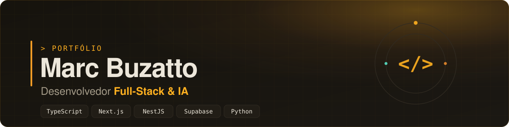
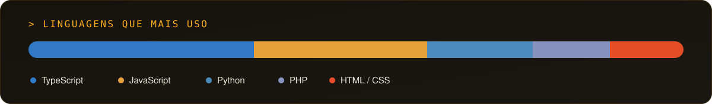

---

## 👋 Sobre mim

Sou **desenvolvedor Full-Stack** com foco em **produtos web modernos** e **aplicações com Inteligência Artificial**. Construo do banco de dados à interface: **APIs, dashboards com regras de negócio, e-commerces, landing pages de alta conversão e automações** (bots, tracking, notificações).

- 🧩 **Full-Stack de verdade** — Next.js/React no front, Node/NestJS e Supabase/Firebase no back, com autenticação, RLS e tempo real.
- 🤖 **IA aplicada** — de plataformas de inferência a *Agent Skills* para o Claude Code.
- 🚀 **Foco em resultado** — performance (Lighthouse 95–100), acessibilidade e conversão.
- 🏢 Toco projetos sob medida através da minha marca **CodeCraft**.

---

## 🛠️ Stack

---

## ⭐ Projetos em destaque

| Projeto | O que é | Stack | Links |
|---|---|---|---|
| **🤖 AI Agents Vault** | Vault de *Agent Skills* para o Claude Code — conhecimento de domínio destilado com *progressive disclosure*. | Python · LLM · MCP | [Código](https://github.com/MarcBuzatto/ai-agents-vault) |
| **🎥 Full-Stack AI Platform** | Plataforma de análise de vídeo com IA em tempo real (detecção de EPI) — WebSocket + OAuth. | NestJS · Nuxt · MongoDB · Socket.io | [Código](https://github.com/MarcBuzatto/Projeto-Teste) |
| **💰 Dashboard Financeiro** | Gestão financeira single-user com *snapshot* de lucro, relatórios e exportação Excel. | Next.js · Supabase · RLS · Vitest | [Código](https://github.com/MarcBuzatto/dashboard-financeiro) · [Demo](https://dashboard-financeiro-navy-gamma.vercel.app) |
| **🕹️ NEXUS — Protocolo Exponencial** | Jogo educativo cyberpunk de matemática (Exp, Log, PA e PG). 100% no navegador. | Next.js · TypeScript · Tailwind | [Código](https://github.com/MarcBuzatto/nexus-protocolo-exponencial) · [Jogar](https://jogo-beryl-beta-68.vercel.app) |
| **⚡ Canvas Speed Controller Plus** | Extensão Chrome (MV3) que controla a velocidade de animações HTML5/canvas. 27 KB, 100% local. | JavaScript · Manifest V3 | [Código](https://github.com/MarcBuzatto/canvas-speed-extension) · [Site](https://canvas-speed-controller-plus.vercel.app) |
| **🌐 CodeCraft** | Site institucional da minha marca — Lighthouse 95–100, bilíngue e dark mode. | React 19 · Vite 6 · Tailwind 4 | [Código](https://github.com/MarcBuzatto/codecraft) · [Demo](https://codecraft-six-amber.vercel.app) |
| **🛡️ Bot Discord — Moderação & Economia** | Bot completo: moderação, economia, níveis, sorteios, anti-raid e tickets. | Python · discord.py | [Código](https://github.com/MarcBuzatto/BOT-DISCORD-MODERACAO-e-ECONOMIA) |

> 📚 **Cada projeto tem um case study técnico completo** no meu [repositório de portfólio](https://github.com/MarcBuzatto/portfolio).

---

## 💼 Projetos para clientes

Além do que está público, entrego software sob medida (código privado por confidencialidade). Alguns tipos de trabalho:

- **🏛️ Site institucional multi-idioma com painel admin** — arquitetura/portfólio, i18n, editor rich-text e autenticação (Next.js · Prisma · NextAuth).
- **🛒 E-commerce completo** — catálogo, carrinho e checkout, integração de pagamento e Firebase (React · TypeScript · Firestore).
- **📊 Dashboards de gestão sob medida** — jurídico, financeiro e operacional, com **Row Level Security**, gráficos e **notificações em tempo real** (Telegram · Web Push/PWA).
- **📈 Landing pages de conversão** — mobile-first, checkout PIX e **tracking Meta Pixel + Conversions API** com deduplicação server-side.

> Quer um projeto assim? [Vamos conversar](https://wa.me/5511994320726).

---

## 📊 GitHub

  

---

**Vamos construir algo juntos.**

